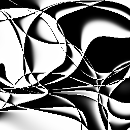

# CPPN-art
## 環境構築
OS: windows10 
CUDA Version: 11.7
cudnn Version: 8.4.1
python: 3.10.5 
<code>pip install -r requirements.txt</code>
## サンプル
### cppn_likely
Jupyter Notebook: cppn(likely)_generate.ipynb 
Python script: src/cppn_likely.py
## 生成画像例

 

## 参考
<ul>
<li>（論文）Compositional Pattern Producing Networks:
A Novel Abstraction of Development:  http://eplex.cs.ucf.edu/papers/stanley_gpem07.pdf</li>
<li>（tensorflow.jsでの実装）Compositional Pattern Producing Networks:
A Novel Abstraction of Development： https://www.expunctis.com/2020/01/19/Abstract-art.html</li>
<li>（書籍）ALIFE | 人工生命 ―より生命的なAIへ: https://www.amazon.co.jp/ALIFE-%E4%BA%BA%E5%B7%A5%E7%94%9F%E5%91%BD-%E4%BB%AE-%E3%82%88%E3%82%8A%E7%94%9F%E5%91%BD%E7%9A%84%E3%81%AAAI%E3%81%B8/dp/4802511264</li>
</ul>
